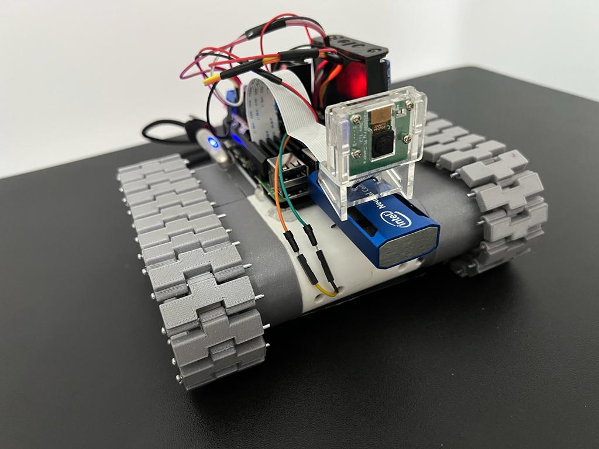
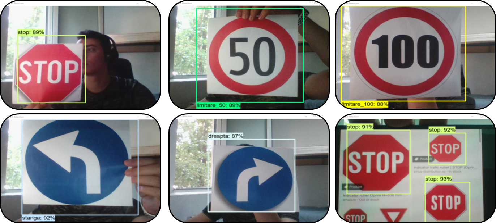
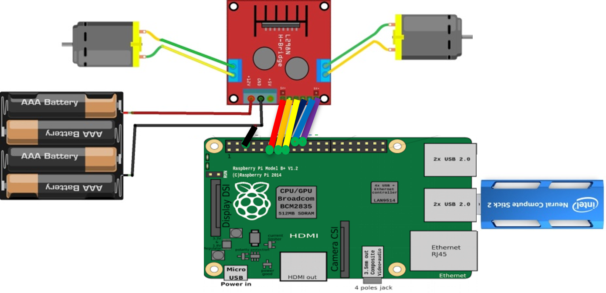
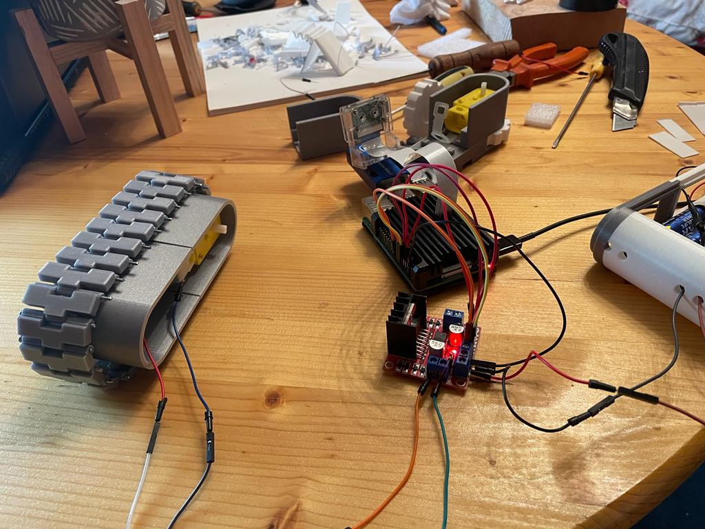
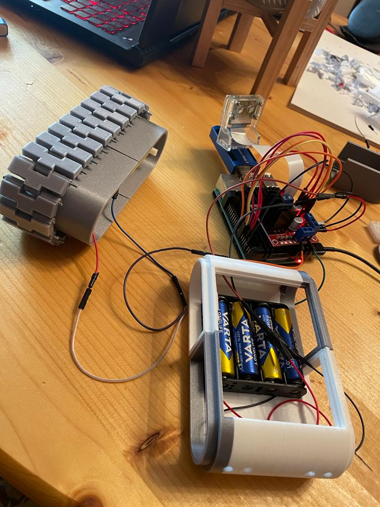

# AI_Autonomous_robot
Autonomous moving robot based on traffic sign detection

The following repository includes all the files and documents covering the construction of a moving platform capable of autonomous driving based on detecting European traffic signs.
 

# The main parts

##  &emsp;1. Creating a model that will detect traffic signs
##  &emsp;2. Developing a moving platform 

  

## 1. Creating detection model
 

 

&emsp;This repository will have all the scripts used in creating the detection model, the conversion step to use the Intel Neural Compute Stick and the final result.

## 2. Moving Platform 
 

 

